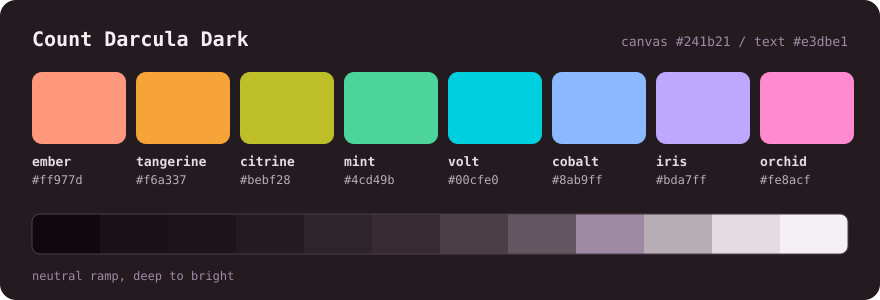
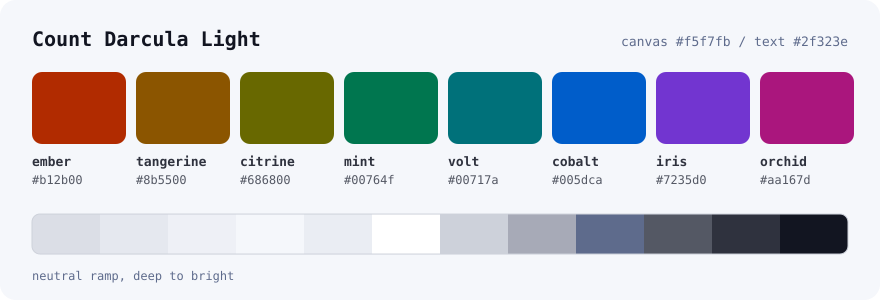

<div align="center">


# Count Darcula

**A Zed theme with a midnight-wine canvas and eight vivid accents, led by electric Volt.**

Every syntax colour sits at one perceptual lightness, and every text colour passes WCAG AA.
Two variants: **Dark** and **Light**.

**[countdarcula.com](https://countdarcula.com)** · [Install](#install) · [Palette](#the-palette) · [Roles](#colour-means-one-thing-everywhere) · [How it's built](#how-its-built)



</div>

---

## The idea

Most themes pick vivid colours and then live with the side effect: a line of code flickers
between loud tokens and quiet ones, because yellow is naturally brighter than blue. Count Darcula
removes that side effect instead of the vividness.

- **One lightness for every accent.** All eight syntax colours sit at the same OKLCH lightness
  (L 78 in Dark, L 50 in Light). Meaning is carried by hue, never by brightness.
- **Chroma is spent, not rationed.** Each accent is pushed to the edge of the sRGB gamut at that
  lightness — that is where the vibrancy comes from, without anything getting brighter.
- **Nothing pure.** No `#ffffff` text, no `#000000` canvas. The Dark canvas carries a faint wine
  undertone; the Light canvas is warm porcelain rather than paper-white.

| variant | canvas | text | syntax band (WCAG) |
|---|---|---|---|
| **Count Darcula Dark** | `#241b21` | `#e3dbe1` · 12.4:1 | 7.78 – 8.93:1 |
| **Count Darcula Light** | `#faf6f3` | `#332921` · 13.2:1 | 5.28 – 6.26:1 |

## The palette




| accent | hue | Dark | Light | used for |
|---|---|---|---|---|
| **Volt** — the signature | 205° | `#00cfe0` | `#00717a` | keywords, focus, accents |
| **Citrine** | 110° | `#bebf28` | `#686800` | functions, methods |
| **Tangerine** | 68° | `#f6a337` | `#8b5500` | types, classes, namespaces |
| **Cobalt** | 258° | `#8ab9ff` | `#005dca` | properties, tags, links |
| **Mint** | 162° | `#4cd49b` | `#00764f` | strings |
| **Orchid** | 345° | `#fe8acf` | `#aa167d` | numbers, constants, parameters |
| **Ember** | 35° | `#ff977d` | `#b12b00` | operators, escapes, symbols |
| **Iris** | 295° | `#bda7ff` | `#7235d0` | booleans, preprocessor, selection |

| neutral | Dark | Light |
|---|---|---|
| canvas | `#241b21` | `#faf6f3` |
| panels | `#1d151b` | `#f4efeb` |
| title & status bar | `#181117` | `#ede7e2` |
| current line | `#2e242c` | `#f2ebe6` |
| borders & selection | `#4b3e47` | `#d8cfc8` |
| comments | `#9f8aa4` | `#79637e` |
| secondary text | `#b7aeb5` | `#5c534d` |
| text | `#e3dbe1` | `#332921` |

| status | Dark | Light |
|---|---|---|
| error | `#ff6367` | `#c21725` |
| warning | `#f0b21b` | `#9a5b00` |
| info | `#59bbfb` | `#0065b0` |
| success | `#56d57b` | `#007835` |

The full set, with OKLCH lightness, WCAG ratio and APCA Lc for every colour, is in
[docs/ACCESSIBILITY.md](docs/ACCESSIBILITY.md).

### Colour means one thing everywhere

Learn it once and every file — TypeScript, Rust, Python, CSS, Markdown — reads the same way:

| colour | role | examples |
|---|---|---|
| Volt | the shape of the program | `if`, `class`, `fn`, `import`, `return` |
| Citrine | things you call | functions, methods |
| Tangerine | things you instantiate | classes, types, enums, namespaces |
| Cobalt | things you address | properties, keys, tags, labels |
| Mint | literal text | strings |
| Orchid | literal values | numbers, constants, parameters, attributes |
| Ember | machinery | operators, escapes, symbols |
| Iris | the language's own words | `true`, `null`, preprocessor, pseudo-selectors |
| text | your own variables | the default, and deliberately the quietest |

Italics appear only where slant carries information colour cannot: comments, parameters,
attributes and `self`/`this`.

## Install

Drop the theme where Zed looks for user themes, then pick **Count Darcula Dark** or
**Count Darcula Light** from <kbd>Cmd</kbd>+<kbd>K</kbd> <kbd>Cmd</kbd>+<kbd>T</kbd>:

```bash
mkdir -p ~/.config/zed/themes
curl -o ~/.config/zed/themes/count-darcula.json \
  https://raw.githubusercontent.com/ChrisNicholson30/Count-Darcula-Theme/main/zed/themes/count-darcula.json
```

Cloned the repo? Symlink instead, and `git pull` keeps it current — Zed reloads the file as it
changes, no restart:

```bash
ln -s "$PWD/zed/themes/count-darcula.json" ~/.config/zed/themes/count-darcula.json
```

`zed/` is also a valid Zed extension (`extension.toml` + `themes/`), so
**Extensions ▸ Install Dev Extension** pointed at that folder works too.

### Follow the system appearance

```json
{
  "theme": {
    "mode": "system",
    "dark": "Count Darcula Dark",
    "light": "Count Darcula Light"
  }
}
```

## Accessibility

`npm test` fails the build if any text colour drops below WCAG AA (4.5:1) on the surface Zed
actually draws it on — not just the canvas, but panels, the terminal, and anything with alpha
composited over what sits underneath. Per variant that is 44 syntax captures, 21 text keys and
14 ANSI slots. Disabled, hidden and predictive (inline-suggestion) text is deliberately quieter;
WCAG exempts it, and a suggestion that met AA would read as code you had already written.

## How it's built

No colour in this repository is hand-picked. Every value is declared as an OKLCH coordinate —
perceptually uniform, so "same lightness" really means same *apparent* lightness — and rendered
to sRGB at build time, trimmed back to the gamut edge where needed rather than clipped.

```
src/palette.js     the single source of truth: OKLCH coordinates for both variants
src/color.js       sRGB ⇄ OKLab ⇄ OKLCH, gamut mapping, WCAG 2.1 and APCA  (no dependencies)
src/zed.js         the role table in Zed's vocabulary: 139 style keys, 46 captures, 8 players
src/zed-schema.js  a snapshot of Zed's key list, so a typo fails the build
src/build.js       renders zed/themes/count-darcula.json and assets/palette-*.svg
src/validate.js    drift, malformed values, unknown keys
src/audit.js       the contrast report; non-zero exit if anything drops below AA
```

```bash
npm run build      # regenerate the theme and palette cards
npm test           # validate + audit (deliberately does NOT build first)
npm run audit      # rewrite docs/ACCESSIBILITY.md
```

The generated files are committed, so the theme installs with no build step. If you change
`src/`, run `npm run build` and commit the result — `npm test` compares the committed output with
a fresh in-memory build and fails on any drift, and CI re-proves it with
`npm run build && git diff --exit-code`.

## Licence

[MIT](LICENSE).
