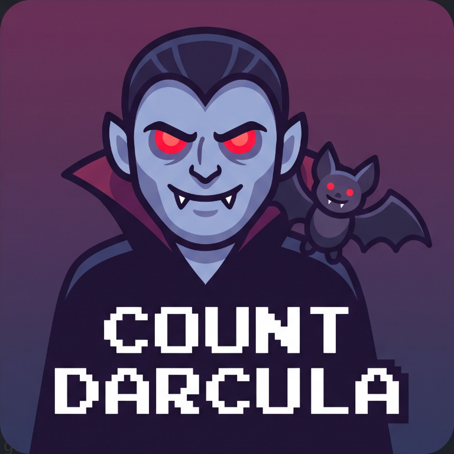
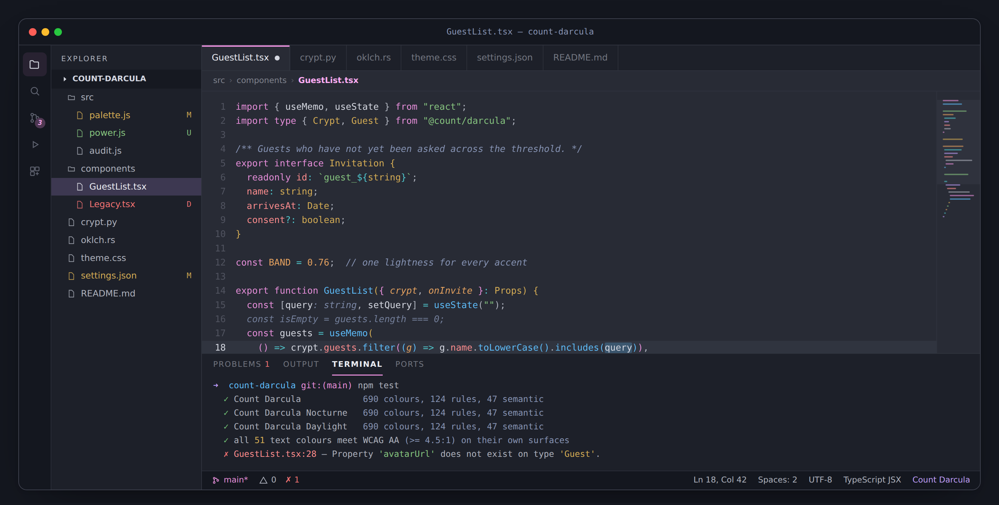
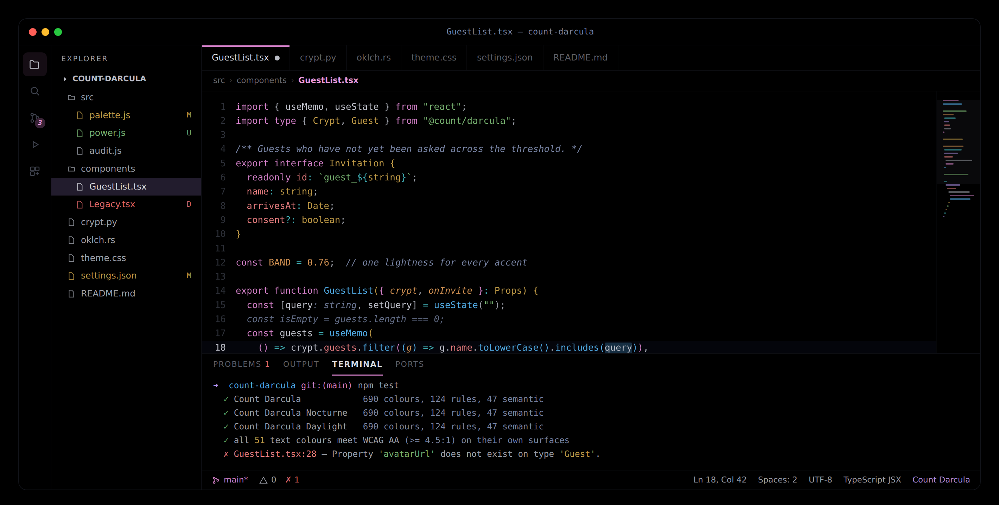
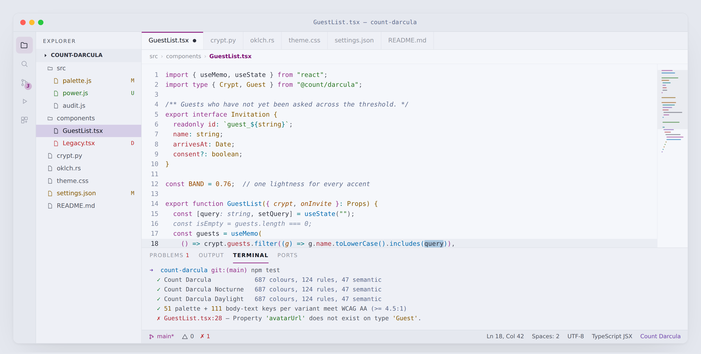

<div align="center">



# Count Darcula

**A VS Code theme that takes Dracula's hues and One Dark's discipline.**

Every syntax colour sits at one perceptual lightness, every text colour passes WCAG AA,
and the true-black *Nocturne* variant cuts modelled OLED panel power by ~48%.

**[countdarcula.com](https://countdarcula.com)** · [Install](#installation) · [Why](#why-another-dark-theme) · [Palette](#the-palette)



</div>

---

## Why another dark theme

Because both parents get one thing right and one thing wrong.

**One Dark** is calm. Low chroma, restrained, easy to sit in for hours. But its foreground
(`#abb2bf`, 6.6:1) is dim, and its red and purple land at 4.38:1 and 4.75:1 — under or barely
at WCAG AA.

**Dracula** has character. Nobody mistakes that pink for anything else. But its palette spans
**L\* 68 → 96**, so a single line of code flickers between near-white yellow and mid-tone red,
and `#f8f8f2` foreground at 13.4:1 blooms in a dark room.

Count Darcula keeps Dracula's *hues* and One Dark's *restraint*, then does the thing neither
does: it **pins every syntax colour to one perceptual lightness**.

| | canvas | lightness spread | lowest contrast | below AA |
|---|---|---|---|---|
| One Dark Pro | `#282c34` | 15.4 L\* | 4.38:1 | 1 |
| Dracula | `#282a36` | 23.5 L\* | 5.90:1 | 0 |
| **Count Darcula** | **`#282b35`** | **0.1 L\*** | **6.19:1** | **0** |

Meaning is carried by hue. Never by brightness. Nothing outshouts its neighbour, the eye stops
re-adapting every few characters, and hour nine feels like hour two.

The background is not a compromise either — `#282b35` is the literal perceptual midpoint of
`#282c34` and `#282a36`.

## The three variants

### Count Darcula

The everyday. Canvas `#282b35`, foreground `#d4d7e0` at 9.8:1 — bright enough to read, dim
enough not to glare.


### Count Darcula Nocturne

Every large surface is `#000000`, so on an OLED panel those pixels draw no current at all. The
whole foreground steps down ~8 L\* as well: less emitted light per glyph, less halation at
night, and the biggest single power saving a theme can offer.



### Count Darcula Daylight

Same eight hues, re-derived for paper. `#f5f7fb` rather than pure white, because the light-mode
equivalent of not using `#f8f8f2` is not using `#ffffff`.



## The palette

Eight hues, each a deliberate blend of the two parents, all generated at **L\* 76** with per-hue
chroma tuned so none looks louder than the others.

| | hex | role | One Dark | Dracula | contrast |
|---|---|---|---|---|---|
| 🌹 rose | `#e58ed9` | keywords, storage | `#c678dd` 318° | `#ff79c6` 347° | 6.19:1 |
| 🔮 violet | `#be9df7` | control flow, decorators | — | `#bd93f9` 302° | 6.29:1 |
| 💧 azure | `#5dbbf8` | functions, methods | `#61afef` 245° | — | 6.68:1 |
| 🕯 gold | `#d3ab54` | types, classes | `#e5c07b` 82° | `#f1fa8c` 113° | 6.54:1 |
| 🩸 coral | `#fb8c8d` | properties, tags | `#e06c75` 17° | `#ff5555` 24° | 6.21:1 |
| 🌿 green | `#86c47f` | strings | `#98c379` 133° | `#50fa7b` 148° | 6.87:1 |
| 🔥 amber | `#e4a15f` | numbers, parameters | `#d19a66` 64° | `#ffb86c` 67° | 6.43:1 |
| ⚗️ teal | `#4fc5cb` | operators, built-ins | `#56b6c2` 206° | `#8be9fd` 213° | 6.85:1 |

Plus a twelve-step neutral ramp on a single hue (272°, midway between One Dark's 264° and
Dracula's 277°) — `#14171f` activity bar, `#1d2029` side bar, `#282b35` canvas, `#8693b3`
comments, `#d4d7e0` foreground, `#eceef4` emphasis.

### Colour means one thing everywhere

Learn it once and every file reads the same way — TypeScript, Rust, Python, YAML, CSS:

```
rose    keywords & storage        the shape of the program (if, class, fn)
violet  flow & metaprogramming    return, await, decorators, macros
azure   things you call           functions, methods, ids
gold    things you instantiate    classes, types, interfaces, components
coral   things you address        properties, keys, tags, selectors
green   literal text              strings
amber   literal values            numbers, constants, parameters
teal    machinery                 operators, escapes, regex, built-ins
fg      your own variables        the default, and deliberately the quietest
```

Italics are used only where slant carries information colour cannot: comments, parameters,
`this`/`self`, type parameters, HTML attributes, markdown emphasis. **Not** on keywords — at
13px, slanted keywords on every other line are exactly the kind of low-grade friction that adds
up over a day. There's a snippet below if you disagree.

## Installation

Count Darcula isn't on any marketplace — it installs by hand, in about a minute. Both routes
below work identically in **VS Code, Cursor, Windsurf and VSCodium**: a colour theme is
declarative, so any editor that renders the VS Code workbench renders this.

### Link it — best if you want updates

```bash
git clone https://github.com/ChrisNicholson30/Count-Darcula-Theme.git
cd Count-Darcula-Theme
npm test    # validate + audit — no dependencies, nothing to install

# macOS / Linux — swap the folder for your editor (table below)
ln -s "$PWD/vscode" ~/.vscode/extensions/count-darcula

# Windows (PowerShell)
# New-Item -ItemType SymbolicLink `
#   -Path "$HOME\.vscode\extensions\count-darcula" -Target "$PWD\vscode"
```

`git pull` then brings you any changes; run **Developer: Reload Window** to pick them up.

| editor | extensions folder |
|---|---|
| VS Code | `~/.vscode/extensions` |
| Cursor | `~/.cursor/extensions` |
| Windsurf | `~/.windsurf/extensions` |
| VSCodium | `~/.vscode-oss/extensions` |

### Package a VSIX — best for another machine

```bash
npm run package    # writes count-darcula-1.1.0.vsix, ~120 KB

code --install-extension count-darcula-1.1.0.vsix
# cursor   --install-extension count-darcula-1.1.0.vsix
# windsurf --install-extension count-darcula-1.1.0.vsix
# codium   --install-extension count-darcula-1.1.0.vsix
```

Or in the UI: **Extensions ▸ ⋯ ▸ Install from VSIX…**

### Cursor

Identical, with `cursor` in place of `code` and `~/.cursor/extensions` in place of
`~/.vscode/extensions`:

```bash
git clone https://github.com/ChrisNicholson30/Count-Darcula-Theme.git
cd Count-Darcula-Theme
npm test

# either link it…
ln -s "$PWD/vscode" ~/.cursor/extensions/count-darcula

# …or install a VSIX
npm run package
cursor --install-extension count-darcula-1.1.0.vsix
```

Then **Developer: Reload Window**.

If `cursor` isn't on your `PATH`, run **Shell Command: Install 'cursor' command** from the
Command Palette — or skip the terminal entirely and use **Extensions ▸ ⋯ ▸ Install from VSIX…**,
which is always available.

Windsurf and VSCodium follow the same shape with their own binary and folder, per the table
above.

### Pick a variant

<kbd>Ctrl</kbd>+<kbd>K</kbd> then <kbd>Ctrl</kbd>+<kbd>T</kbd> (<kbd>⌘</kbd>+<kbd>K</kbd>
<kbd>⌘</kbd>+<kbd>T</kbd> on macOS), and choose Count Darcula, Count Darcula Nocturne or
Count Darcula Daylight.

One caveat on the forks: they add chrome VS Code doesn't have — Cursor's AI pane and inline-edit
widget, for instance. Where those reuse standard VS Code colour tokens they're themed (this sets
`inlineChat.*`, `chat.*` and `editorGhostText.*` among the 687), but any surface a fork invents
outside that vocabulary falls back to its own dark defaults. The editor, terminal, side bar, tabs
and status bar are exact.

### Settings worth having

Follow the system, dark by night and light by day:

```jsonc
{
  "workbench.preferredDarkColorTheme": "Count Darcula",
  "workbench.preferredLightColorTheme": "Count Darcula Daylight",
  "window.autoDetectColorScheme": true
}
```

The rest of the setup this theme was designed against:

```jsonc
{
  "editor.fontFamily": "JetBrains Mono, SF Mono, Menlo, Consolas, monospace",
  "editor.fontSize": 13.5,
  "editor.lineHeight": 1.6,
  "editor.semanticHighlighting.enabled": true,
  "editor.bracketPairColorization.enabled": true,
  "editor.guides.bracketPairs": "active",

  // the terminal ANSI set is already >= 4.5:1, so let it through untouched
  "terminal.integrated.minimumContrastRatio": 1
}
```

Want italic keywords after all:

```jsonc
{
  "editor.tokenColorCustomizations": {
    "[Count Darcula*]": {
      "textMateRules": [
        { "scope": ["keyword", "storage"], "settings": { "fontStyle": "italic" } }
      ]
    }
  }
}
```

## Zed

The same theme, generated from the same palette, in Zed's own vocabulary — 139 style keys, 46
tree-sitter syntax captures and 8 collaborator cursors. `keyword` is rose in both editors because
it is rose in `src/palette.js`, not because it was typed twice.

All three variants ship in one file; Zed lists each as a separate entry in its theme picker.

```bash
mkdir -p ~/.config/zed/themes
curl -o ~/.config/zed/themes/count-darcula.json \
  https://raw.githubusercontent.com/ChrisNicholson30/Count-Darcula-Theme/main/zed/themes/count-darcula.json
```

Then <kbd>Cmd</kbd>+<kbd>K</kbd> <kbd>Cmd</kbd>+<kbd>T</kbd> and pick a variant. Zed watches the
file, so there is no restart — and if you cloned the repo, symlink instead and `git pull` keeps
it current:

```bash
ln -s "$PWD/zed/themes/count-darcula.json" ~/.config/zed/themes/count-darcula.json
```

`zed/` is also a valid Zed extension — `extension.toml` plus `themes/` — so
**Extensions ▸ Install Dev Extension** pointed at that folder works too.

### What differs from the VS Code build

Not the colours. Zed's surface is smaller and flatter, so some things simply have no counterpart:
there are no bracket-pair colours, no per-language semantic tokens, no inlay-hint chips. Where
Zed has something VS Code doesn't, it's wired up: the eight collaborator cursors get one accent
hue each, and the terminal's `dim_*` ANSI tier is filled rather than left to default.

The contrast standard is the same and audited the same way — `npm test` measures all 44 syntax
captures, 21 text keys and 14 ANSI slots per variant against the surfaces Zed actually draws them
on. Zed accepts unknown keys silently rather than erroring, so `src/validate.js` also checks every
key emitted against a snapshot of Zed's schema and reports anything left to defaults.

## Accessibility

Contrast is measured in two passes, and `npm test` fails on either.

**The palette** — the twelve neutrals, eight accents and four status colours, against the canvas,
in WCAG 2.1 ratios and APCA Lc. APCA models light-on-dark text far better than WCAG 2.x does, and
a dark theme is nothing but light-on-dark text.

```
✓ all 51 palette colours meet WCAG AA (>= 4.5:1)
  syntax band: contrast 6.19–6.87:1 (spread 0.68), lightness 75.9–76.1 L*
```

**The generated theme** — because a swatch that passes on the canvas can still fail inside a
widget or on a filled badge, and the palette pass would never see it. So every foreground key in
the built JSON is re-measured against the surface it actually renders on, compositing alpha on
both sides: 221 keys per variant, 17 of them translucent.

```
variant                  measured   body text   ui/icons   de-emphasised   fails
Count Darcula                 221         111         88              22       0
Count Darcula Nocturne        221         111         88              22       0
Count Darcula Daylight        221         111         88              22       0
```

Not everything is held to the same bar, because WCAG doesn't:

| tier | what | required |
|---|---|---|
| body text | editor, lists, tabs, terminal, menus, widgets | **4.5:1** (1.4.3) |
| icons & controls | fold chevrons, breakpoints, cursors, brackets | **3:1** (1.4.11) |
| de-emphasised | disabled, inactive, placeholders, inline suggestions | reported, not required |
| decoration | scrollbar marks, indent guides, rules, sliders | not text, not measured |

The de-emphasised tier is where honesty matters, so the audit prints every one of those 22 with
its measured ratio rather than quietly excluding them. WCAG 1.4.3 exempts disabled controls, and
an inline AI suggestion that met 4.5:1 would read as code you'd already written. Inactive line
numbers sit at 3.31:1 and inline suggestions at 3.48:1; the floor is 1.46:1, for the line numbers
VS Code itself dims further in relative-number mode. The *active* line number — the one you are
actually reading — stays at 9.8:1.

Comments are deliberately **not** in that tier: they're held above AA at 4.60:1. A comment is
still text, and a comment nobody can read is a comment nobody maintains — the recession comes
from lower chroma and italics, not from making it dim.

Full per-colour numbers for all three variants: **[docs/ACCESSIBILITY.md](docs/ACCESSIBILITY.md)**.

## Battery

On an OLED/AMOLED panel each subpixel emits its own light, so panel power follows the image.
Using the standard per-channel model (Dong, Choi & Zhong, DAC 2009 — blue weighted 1.56× green,
because blue emitters are the least efficient) applied to a modelled full-screen VS Code window:

| theme | modelled panel power |
|---|---|
| **Count Darcula Nocturne** | **51.5%** |
| Default Dark+ | 77.4% |
| One Dark Pro | 83.7% |
| **Count Darcula** | **100%** (baseline) |
| Dracula | 121% |
| A stock light theme | 1347% |

Nocturne draws **48.5% less than the flagship** and **57.4% less than Dracula** on that model.
The flagship itself sits 21% below Dracula but 16% *above* One Dark — that is the honest cost of
a foreground bright enough to read at 9.8:1, and it is why Nocturne exists.

**What this will not do:** on a conventional LCD the backlight is on at the set brightness
regardless of content, so a dark theme saves essentially nothing directly. The real win there is
indirect — a dimmer image is comfortable at a lower brightness setting, and backlight power
scales steeply with brightness.

These are modelled figures, not measurements of your laptop. The model lives in
[`src/power.js`](src/power.js); read it and disagree with it.

## Preview page

**[countdarcula.com](https://countdarcula.com)** — a live VS Code mockup across six languages, a
variant switcher that re-themes the whole page, the palette with measured contrast, the
lightness-spread comparison against both parents, the OLED power chart, and install instructions.

The same page ships in this repo as [`preview.html`](preview.html), so it works offline and
cannot drift from the theme: it is generated from `src/palette.js` by `npm run preview`. It is
self-contained — no build step, no network requests, no dependencies — so `open preview.html`
is all it takes.

## How it's built

No colour in this repository is hand-picked. Every value is declared as an OKLCH coordinate —
perceptually uniform, so "same lightness" actually means same *apparent* lightness — and
rendered to sRGB at build time.

```
vscode/            a self-contained, packageable VS Code extension
zed/               a Zed extension: extension.toml + themes/
src/               the shared generator — both editors come out of here
assets/  docs/  preview.html
```

```
src/palette.js     the single source of truth: OKLCH coordinates for all three variants
src/color.js       sRGB ⇄ OKLab ⇄ OKLCH, WCAG 2.1 contrast, APCA 0.1.9 Lc  (no dependencies)
src/workbench.js   687 UI colours per variant, derived from the palette
src/terminal.js    the terminal, including the 16 ANSI slots
src/syntax.js      124 TextMate rules + 47 semantic tokens, built from a role table
src/zed.js         the same role table in Zed's tree-sitter vocabulary
src/zed-schema.js  a snapshot of Zed's key list, so a typo fails the build
src/power.js       the OLED power model
src/build.js       renders vscode/themes/*.json and zed/themes/count-darcula.json
src/validate.js    malformed values, illegal fontStyle, shadowed scopes, src ⇄ themes drift
src/coverage.js    resolves every foreground to its real surface and composites alpha
src/audit.js       contrast + power report; non-zero exit if anything drops below AA
src/preview.js     regenerates the data baked into preview.html
```

```bash
npm run build      # regenerate both editors' themes
npm test           # validate + audit (deliberately does NOT build first)
npm run audit      # write docs/ACCESSIBILITY.md
npm run preview    # refresh preview.html from the palette
npm run package    # build a VSIX for installing elsewhere
```

Change one number in `src/palette.js` and all three variants stay consistent, the audit
re-measures itself, and the preview page cannot drift from the theme it is advertising.

The generated theme files are committed, so both editors work with no build step.
If you change `src/`, run `npm run build` and commit the result — `npm test` fails otherwise.

That ordering is deliberate: `npm test` validates *before* building, so it compares the committed
JSON against a fresh in-memory build and can actually see drift. Running the build first would
overwrite the very thing the check exists to catch, and the check would be dead. CI re-proves it
from the other side with `npm run build && git diff --exit-code`.

## Credits

Standing on two very good themes:

- [**One Dark Pro**](https://binaryify.github.io/OneDark-Pro/) by Binaryify, itself after Atom's One Dark
- [**Dracula**](https://draculatheme.com/visual-studio-code) by Zeno Rocha and contributors

Count Darcula is an independent work — not affiliated with or endorsed by either project. Their
palettes are quoted here only for comparison.

## Licence

[MIT](LICENSE).
