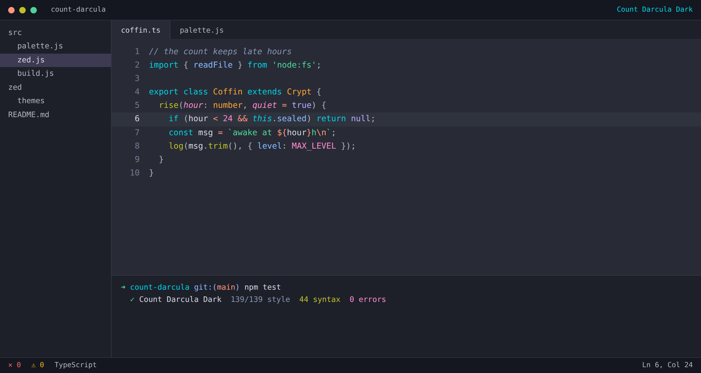
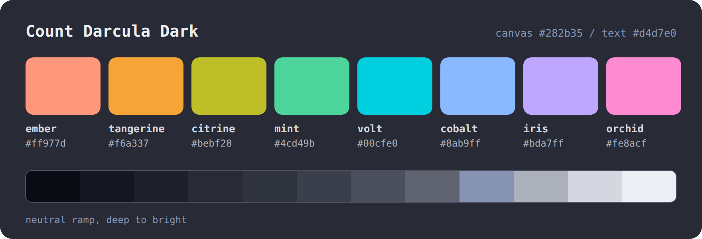
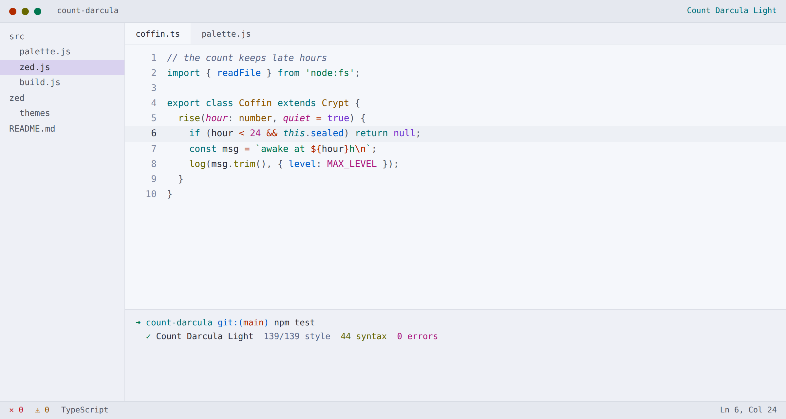
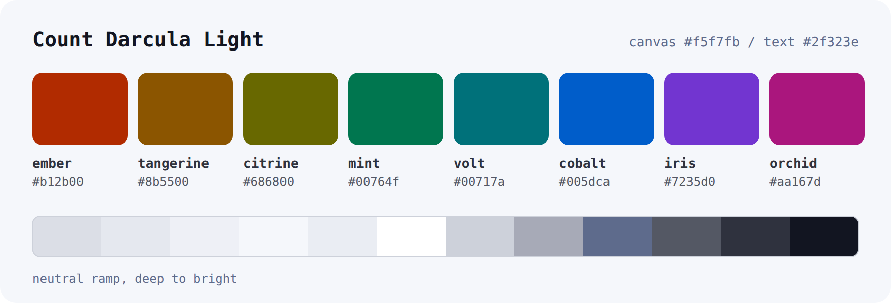

# Count Darcula 2.0 — What Changed and How It Looks

Version 2.0.0 · 27 September 2026 · Zed only · Dark and Light

## At a glance

| Area | Before (1.2.0) | After (2.0.0) |
|---|---|---|
| Identity | A blend of Dracula's hues and One Dark's restraint | Its own palette, names and colour roles |
| Editors | VS Code, Cursor, Zed | Zed only |
| Variants | Count Darcula, Bloodline, Nocturne, Daylight | Count Darcula Dark, Count Darcula Light |
| Dark background | `#282b35`, slate blue-grey | `#282b35`, unchanged |
| Light background | `#f5f7fb`, cool paper | `#f5f7fb`, unchanged |
| Signature colour | Rose pink | Volt, an electric cyan |
| Dark syntax contrast | 6.19 to 6.87:1 | 6.56 to 7.53:1 |
| Light syntax contrast | 4.96 to 6.17:1 | 5.29 to 6.28:1 |

## How it looks

### Count Darcula Dark





### Count Darcula Light





These previews are drawn from the real colours in the generated Zed theme file. The window
itself is a mock-up, not a screenshot of Zed.

## The design, in three rules

1. **One brightness for every accent.** All eight syntax colours share one perceived
   lightness: L 78 in Dark, L 50 in Light. Hue tells you what a token is. Brightness never
   does, so no token shouts over its neighbours.
2. **Saturation is maxed out.** Each accent is pushed as far as a normal screen can show at
   that lightness. That is where the vibrancy comes from, without anything getting brighter.
3. **Nothing pure.** There is no pure-white text and no pure-black background. Every text
   colour still passes the WCAG AA contrast minimum of 4.5:1.

## The palette

### Accents

| Name | Hue | Dark | Light | Used for |
|---|---|---|---|---|
| **Volt** (signature) | 205° | `#00cfe0` | `#00717a` | keywords, focus, accents |
| **Citrine** | 110° | `#bebf28` | `#686800` | functions, methods |
| **Tangerine** | 68° | `#f6a337` | `#8b5500` | types, classes, namespaces |
| **Cobalt** | 258° | `#8ab9ff` | `#005dca` | properties, tags, links |
| **Mint** | 162° | `#4cd49b` | `#00764f` | strings |
| **Orchid** | 345° | `#fe8acf` | `#aa167d` | numbers, constants, parameters |
| **Ember** | 35° | `#ff977d` | `#b12b00` | operators, escapes, symbols |
| **Iris** | 295° | `#bda7ff` | `#7235d0` | booleans, preprocessor, selection |

### Neutrals

| Role | Dark | Light |
|---|---|---|
| Canvas (editor background) | `#282b35` | `#f5f7fb` |
| Panels and terminal | `#1d2029` | `#eef0f6` |
| Title and status bar | `#14171f` | `#e5e8ef` |
| Current line | `#30343f` | `#eaedf3` |
| Borders and selection | `#4b4f5d` | `#cdd1da` |
| Comments | `#8693b3` | `#5e6b8c` |
| Secondary text | `#adb1bc` | `#545864` |
| Text | `#d4d7e0` | `#2f323e` |
| Emphasis | `#eceef4` | `#121521` |

### Status

| Status | Dark | Light |
|---|---|---|
| Error | `#ff6367` | `#c21725` |
| Warning | `#f0b21b` | `#9a5b00` |
| Info | `#59bbfb` | `#0065b0` |
| Success | `#56d57b` | `#007835` |

## Colour roles: old versus new

The roles were reassigned so that no token keeps the colour it had in the old theme.

| Token | 1.2.0 colour | 2.0.0 colour |
|---|---|---|
| Keywords | Rose `#e58ed9` | Volt `#00cfe0` |
| Functions | Azure `#5dbbf8` | Citrine `#bebf28` |
| Types and classes | Gold `#d3ab54` | Tangerine `#f6a337` |
| Properties and tags | Coral `#fb8c8d` | Cobalt `#8ab9ff` |
| Strings | Green `#86c47f` | Mint `#4cd49b` |
| Numbers and parameters | Amber `#e4a15f` | Orchid `#fe8acf` |
| Operators and escapes | Teal `#4fc5cb` | Ember `#ff977d` |
| Booleans and preprocessor | Violet `#be9df7` | Iris `#bda7ff` |

Dark values shown. Italics still appear only on comments, parameters, attributes and
`this`/`self`.

## Every change

### Changed

- **New accents.** Eight named accents with new hues and a new role table. The greys (canvas,
  panels, borders, text) are the original slate ramps, unchanged.
- **Variants renamed** to `Count Darcula Dark` and `Count Darcula Light`. Anyone who had the old
  names selected needs to pick the theme again in Zed.
- **Better colour maths.** When a colour is too saturated for a normal screen, it now gives up
  saturation and keeps its hue and brightness. The old build clipped the colour instead, which
  shifted the most vivid accents off their intended hue and brightness.
- **Version 2.0.0** in `package.json` and `zed/extension.toml`, with a new description.
- **README, Zed README and changelog** rewritten for the new identity.
- **CI** now checks the Zed theme and the palette cards for drift and uploads the `zed/` folder.
  It no longer packages a VS Code extension.

### Added

- **Palette cards.** `assets/palette-dark.svg` and `assets/palette-light.svg` are generated by
  the build and checked by CI, so they always match the theme.

### Removed

- **VS Code and Cursor support:** the `vscode/` extension, its four theme files and VSIX
  packaging.
- **The VS Code generators:** `workbench.js`, `terminal.js`, `syntax.js` and `coverage.js`.
- **Bloodline and Nocturne**, plus the OLED power model (`power.js`) that only Nocturne needed.
- **The preview page** (`preview.html`, `preview.js`) and the four old screenshots.
- **All Dracula and One Dark references and comparisons** in the code and docs. Earlier
  changelog entries still mention them as history.

### Kept

- The **Count Darcula** name and the mascot logo, because of countdarcula.com.
- The quality checks. `npm test` still fails the build if any text colour drops below AA on
  the surface Zed actually draws it on. For each variant, that covers 44 syntax captures,
  21 text keys and 14 terminal colours.

## Install

```bash
mkdir -p ~/.config/zed/themes
curl -o ~/.config/zed/themes/count-darcula.json \
  https://raw.githubusercontent.com/ChrisNicholson30/Count-Darcula-Theme/main/zed/themes/count-darcula.json
```

To switch between Dark and Light automatically with the system appearance, add this to Zed's
settings:

```json
{
  "theme": {
    "mode": "system",
    "dark": "Count Darcula Dark",
    "light": "Count Darcula Light"
  }
}
```

## Still to do

- [ ] Take real Zed screenshots of both variants for the README and countdarcula.com.
- [ ] Update the marketing site with the colours above.
- [ ] Decide whether Citrine and Tangerine should be brighter in Light. They read as olive and
  brown because yellow has to be that dark to stay legible on a light background.
- [ ] Merge `claude/exciting-volta-wmaf3p` into `main`. The install link above only serves the new
  theme after that.
